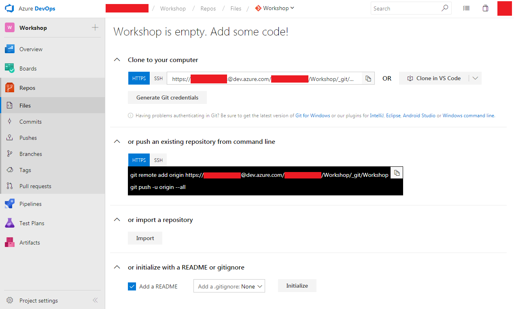
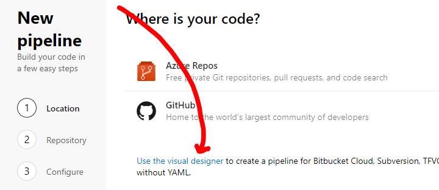
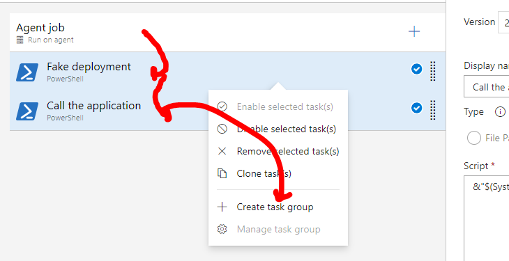
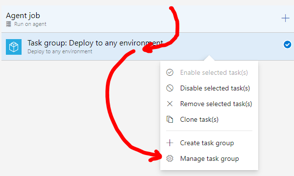
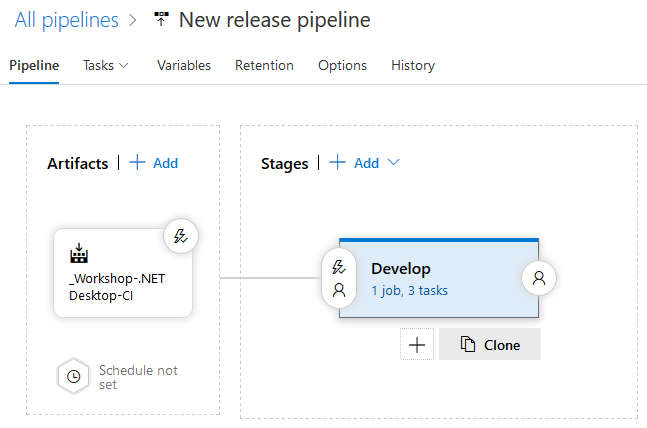
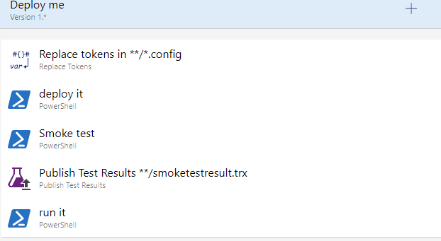

#Azure pipelines

Welcome to this workshop building and deploying applications with Azure Devops. This workshop focusses on the possibilities building your pipeline and the practice of creating a single artifact and using that same artifact for all your phases. Each phase building your confidence in the quality of your artifact and lowering the risk when it hits production.


Azure Devops is completely free up to 5 users. You can set it up without a creditcard and it is the only tool we will be using for this workshop.
1. Create account

    * Start page for azure devops services user guide:  
    https://docs.microsoft.com/en-us/azure/devops/user-guide/?view=vsts
    * Create account:  
    https://docs.microsoft.com/en-us/azure/devops/user-guide/sign-up-invite-teammates?view=vsts
    * Create a project

We can't publish anything without the sources to create an artifact. All the code needed during this workshop is in this repository or will be provide in the texts.
1. We are going to get the code from the github repo into our own Azure Devops Git repo. Creating a build and running it will give us an independant place to validate our code. This prevents the "It works on my machine" conversation. After it builds we have our artifact to start our deployment.  


    * In your project click on menu item `Repos`
    * Check which ways you can create your repository

    * Click on `import` under heading `or import a repository`
    * Enter URL: `https://github.com/ErickSegaar/TGIF_AzurePipelines.git` and click `import`
    * After the import is done, you should be redirected to your Git repository.  
    *Note: In this workshop we'll use the web interface for any code changes. If you prefer you can swith to Git. Use the `Clone` button on the top right to get your repository's URL.*

1. Create your first build
	* Go to Pipelines -> builds -> `New pipeline`  
    
    * We come back to yaml later for now choose the visual designer  
    
    * Leave everything default and click `Continue`  
    
    * Select the `.NET Desktop` template and click `Apply`  
    
    * To get familiar with the build check each task. You can see the template added:
        * The restore of nuget packages used for compilation of your application in our case NUnit
        * Build and unittest our application
        * Publish the symbols for later debug possibilities
        * Publish the created artifacts back into Azure Devops

    * Click `Save & queue` and in the new window click `Save & queue` again
    * Click on the new build `#<date>.1` in the top-left to follow its progress:  
    

1. Fixing your build
    By now you should notice that your build failed, this is because there is a bug in the calculator class. 
    * Check out the build log click your finished build see that the test failed and click `Tests`  
    
    * In the test results you can see that some tests succeeded and some failed  
      
    To fix this we need to change the calculator class but first create a continues build. This will make it so that everytime we make a change to the repository a build will trigger to validate the changes. This will notify you when you made a change that does not compute. **This is not Continues Integration** CI is a practice that requires more than just a continuous build every time you change your bits, but it is certainly part of it. 
    * Enable Continuous Build  
    Go to your build definition and choose `Edit`, `Triggers`, check the box of `Enable continuous integration` and `Save`
    * Fix the calculator class
    Go to your `Repos` find the `Calculator.cs` click `Edit`
      
    Replace just the line `return a * b;` with `return a + b;` because we abviously made a mistake using a **Multiplication (*)** instead of **Add (+)**
    * Click `Commit` add a nice message and click `Commit again`  
    
    Now your build is triggered immediately, go and check it out now your tests should succeed.

1. Create release for single environment

      
    Now we have an artifact it is time to spin up some tasks to mimic the deployment. We are going to use powershell for that.
	* In the menu go to `Pipeline` > `Releases` and click on `New pipeline`
    * Select `Empty job`
    * Add the artifact of the build with `Add an artifact`
    * Click on `Stage 1` and change the `Stage name` to `Prod`
    * Click on `Tasks` to define your deployment for `Prod`
    * Click the + button and add a `Powershell` task
    * Click on the `Powershell` task and configure it:
        * Rename the Display name to `Fake deployment`
        * Set `Type` to `inline`
        * Overwrite the `Script` field with:  
        `Write-Host "This task mimics the deployment as we won't go to azure today"`
    * Right-click the `Powershell` task and select `Clone task(s)`
    * Configure the cloned task:
        * Rename the Display name to `Call the application`
        * Change script to:  
        `&"$(System.DefaultWorkingDirectory)/$(Release.PrimaryArtifactSourceAlias)/drop/EchoConsole/bin/Release/EchoConsole.exe" "Hello World"`  
      
    * `Save` the release pipeline
    * Create a new release to deploy your build and check the logs of the deployment
	* Talk about approvals

1. Change the code to use variables

      
    Now we have an artifact deployed to our production environment we start to wonder if that is such a wise descision. Let's create a few more phases, we first want to test our deployment and want to have the possibility to test our code before it will be release to production. Therefor we create 2 stages `Develop` and `Test`. We also want to deploy to an environment that is "production like", as a final check that we won't bump into some trouble in prod that we could have caught earlier. (There are more strategy types verry usefull to give you more confidence in prod like matrix, ringdeployment and feature switch strategy. But this pre-prod is a well known and often wrongly used one.) Offcourse we can start and clone/copy the current `Prod` problem with that is whenever we make a change afterwards we need to apply that change to all stages identically, a disaster waiting to happen. Let's make sure alle stages always use the same steps for deployment.
    * Create a taskgroup  
      
    Go to the `Tasks` of you `Prod` stage and Ctrl+Click the `Fake deployment` and `Call the application` tasks. Now rightclick and choose `Create task group`. Next choose a nice name and leave everything default and click `Create`. We now made a taskgroup and you can re-use it in any phase. Next `Save`
	* We should also Enable CD because whenever we have a new artifact it should be deployed automatic.  
	Go to your release pipeline and choose `Edit`, and click on the lightning bolt at the artifact, set the `Continuous deployment trigger` to `Enabled` and `Save`
	* First change the application to get some values from the applicationconfig. Go to `Repos`, `EchoConsole/Program.cs` and click on `Edit` to change the file to:  
        ```
        using System;
        using System.Linq;

        namespace EchoConsole
        {
            class Program
            {
                static void Main(string[] args)
                {
                    bool runSmoke = args.Contains("-smoke");

                    if (runSmoke)
                    {
                        Smoke smoke = new Smoke();
                        smoke.Execute();
                        return;
                    }

                    if (args.Any())
                    {
                        Console.WriteLine($"Given argument {args.First()}");
                    }

                    Console.WriteLine(System.Configuration.ConfigurationManager.AppSettings.Get("ApplicationEnvironment"));            
                }
            }
        }
        ```
	* Now commit your changes, with the comment `Changed my program with application settings`
    * **Check your build and once that's finished the new release. Talk about what you see**

1. Change release to inject pipelines for different environment

    If we are going to use the same artifact to all deployments how do we defere databaseconnections or different webadresses. We are accomplishing that by the use of tokens in the configuration files. Those tokens will be injected by the pipeline at deployment time.  
    * First we're going to install an extenstion from the marketplace:
        * Click on the shopping bag icon in the top-right, then `Browse Marketplace` 
        * Search & install "Replace Tokens"
	* Add 3 more environments with different environment variables:
        * Go to the `Edit` screen of your release pipeline and go to `Tasks` right click the recently created task group `Manage task group`.  
          
        * Add the `Replace Tokens` task as the first step after the `Fake Deployment` step, save the Task group
        * Go back to `Variables` and add the `ApplicationEnvironment` variable  with a prod value and scope `Prod`
        * Go back to the pipeline overview and clone the `Prod` stage 3 times to:
            * Develop
            * Test
            * Pre prod  
        
        * Arrange the environments that Develop triggers after release creation and each other environment after a succesfull deploy of the previous one
        
        * now go back to the variables and notice that also the `ApplicationEnvironment` variable has been cloned. Replace the value for each environment to one to represent the scope. 
        
        * **Talk about the variables to understand its scoping and what each value means for each stage in your release pipeline**
        * `Save` your release pipeline

    * Now we're going to `Edit` the EchoConsole/app.release.config file in your repository to use the `ApplicationEnvironment` variable:
        ```
        <?xml version="1.0" encoding="utf-8"?>
        <!--For more information on using transformations see the web.config examples at http://go.microsoft.com/fwlink/?LinkId=214134. -->
        <configuration xmlns:xdt="http://schemas.microsoft.com/XML-Document-Transform">
            <appSettings>
                <add key="ApplicationEnvironment" value="#{ApplicationEnvironment}#" xdt:Transform="Insert"/>
            </appSettings>
        </configuration>
        ```
	- Commit the change and watch your build complete and start your deployment automaticly first to dev, test, preprod, prod. After the release completes you can validate the injected values from the log for each environment.

1. Explain different possibilities for releasing, libraries, and taskgroups  
Administering one pipeline can be easy, but what makes it hard is when you have hundreds. How can you make it easier to change multiple envrionments at once?
    * **Talk about versions and drafts**
    * Add a variable group
        * Go to `Pipelines`, `Libraries` and click on `+ Variable Group`
        * Give it the name `GeneralVariables` 
        * Use `+ Add` to create variable `GeneralInfo` and give it a unique value
        * `Save` the variable group
    * Link the variable group to your release pipeline
        * Go to the `Edit` screen of your release pipeline and go to `Variables`, `Variable groups` and click the `Link variable group` button
        * Select `GeneralVariables` and click the `Link` button
        * `Save` your release pipeline
    * `Edit` the following code:
        * In EchoConsole/app.release.config replace:  
        ```
        <add key="ApplicationEnvironment" value="#{ApplicationEnvironment}#" xdt:Transform="Insert"/>
        ```
        with:  
        ```
        <add key="ApplicationEnvironment" value="#{ApplicationEnvironment}#" xdt:Transform="Insert"/>
        <add key="GeneralInfo" value="#{GeneralInfo}#" xdt:Transform="Insert"/>
        ```
        * In EchoConsole/program.cs replace:  
        ```
        if (args.Any())
        {
            Console.WriteLine($"Given argument {args.First()}");
         }
        ```
        with:  
        ```
        if (args.Any())
        {
            Console.WriteLine($"Given argument {args.First()}");
        }
        Console.WriteLine(System.Configuration.ConfigurationManager.AppSettings.Get("GeneralInfo"));
        ```
    * check the changes in your build and deployment logs
1. Add smoke tests to your deployment
    
    We just can't introduce new changes to our code and not test them. We have our unittest, and ofcourse the team will run tests on the test environment but we are changing configuration every step. We need to validat this before any of our customers uses our application. We do that by using smoke tests, and yes you do those tests also in production. There is a simple implementation in the code for the workshop. But how you implement depends on application type, architecture and environment. **But it is an absolute MUST, we can let an application crash just as hard using a configuration change as I can by changing the code**
    * Go to the earlier created `taskgroup`  
            
        * add a new inline `powershell` script right after the `Replace token` step. Make use of this script:  
    `&"$(System.DefaultWorkingDirectory)/$(Release.PrimaryArtifactSourceAlias)/drop/EchoConsole/bin/Release/EchoConsole.exe" "-smoke"`
        * Next add `Publish Test results` step with:
            * Test result format `VSTest`
            * Test result files `**/smoketestresult.trx`
            * Under Advanced change Run this task to `Even if a previous task has failed, unless the deployment was canceled`
    * Save and start a new release, now you can see once an environment completes a percentage succeeded test, click on it and adujust the filter to find out what worked and what didn't.  
      
    

1. Change release to use parrallelization

      
	- Add a variable array $(environments) with the value First, Second
	- change agent mode of the latest 2 environments to parrallelization with 2 agents and run it.
    - change the tasklibrary to call the application to `&"$$(System.DefaultWorkingDirectory)/$(Release.PrimaryArtifactSourceAlias)/drop/EchoConsole/bin/Release/EchoConsole.exe" "$(Environments)"`
	- Discuss scenario's for this mode

1. Switch to javascript, yaml and linux

      
    - Import https://github.com/MicrosoftDocs/pipelines-javascript.git into a new repository
    - Create a new build definition, this time use the yaml one. Use the azure repo, next next finish. It will detect the yaml in the project

1. Let's try to use 1 build for all your branches, when a branch comes from a feature branch it cannot be deployed automatically but only manual and only master can go past your test environment
Done?

1. Create tokens
	- create token with right scope
	- explain system and PAT tokens

1. Change build for web application to Private Linux
	- Run the docker container with private agent, attached to your public azure devops
	- change to the new queue with the private agent
	- change up the container to get a extra layer for an environment variable
	- run another private agent with the new container
	- force the build to the later agent
	- Talk about scenario to use private agents, directing build capabilities, how this can be cool with k8s pods and scale
