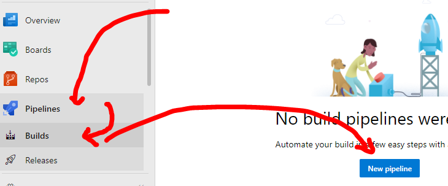
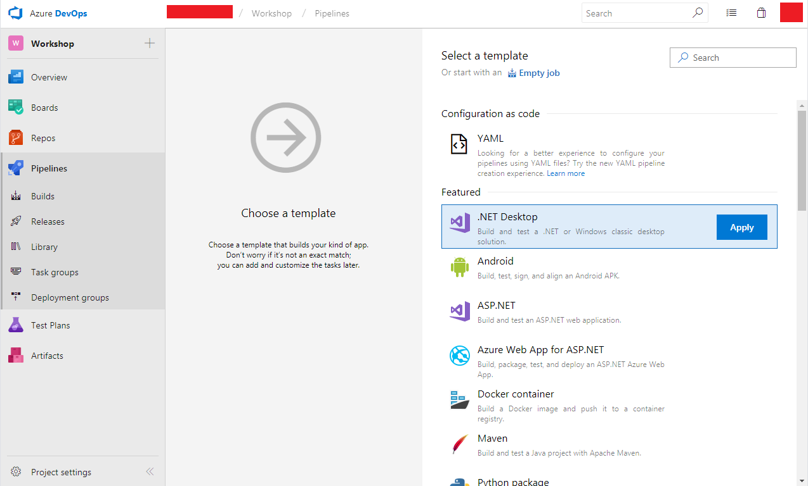
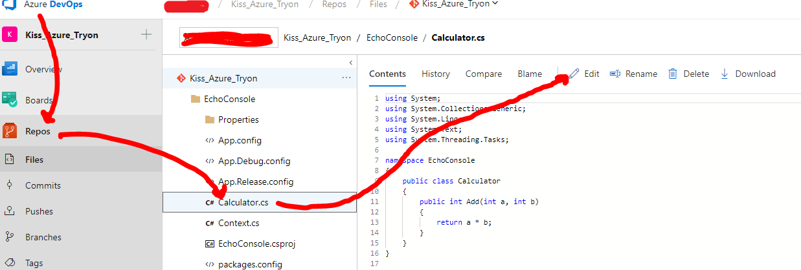

#Azure pipelines

Welcome to this workshop building and deploying applications with Azure Devops. This workshop focusses on the possibilities building your pipeline and the practice of creating a single artifact and using that same artifact for all your phases. Each phase building your confidence in the quality of your artifact and lowering the risk when it hits production.


Azure Devops is completely free up to 5 users. You can set it up without a creditcard and it is the only tool we will be using for this workshop.
1. Create account

    * Start page for azure devops services user guide:  
    https://docs.microsoft.com/en-us/azure/devops/user-guide/?view=vsts
    * Create account:  
    https://docs.microsoft.com/en-us/azure/devops/user-guide/sign-up-invite-teammates?view=vsts
    * Create a project

We can't publish anything without the sources to create an artifact. All the code needed during this workshop is in this repository or will be provide in the texts.
1. We are going to get the code from the github repo into our own Azure Devops Git repo. Creating a build and running it will give us an independant place to validate our code. This prevents the "It works on my machine" conversation. After it builds we have our artifact to start our deployment.


    * In your project click on menu item `Repos`
    * Check which ways you can create your repository

    * Click on `import` under heading `or import a repository`
    * Enter URL: `https://github.com/ErickSegaar/TGIF_AzurePipelines.git` and click `import`
    * After the import is done, you should be redirected to your Git repository.  
    *Note: In this workshop we'll use the web interface for any code changes. If you prefer you can swith to Git. Use the `Clone` button on the top right to get your repository's URL.*

1. Create your first build
	* Go to Pipelines -> builds -> `New pipeline`
    
    * We come back to yaml later for now choose the visual designer
    
    * Leave everything default and click `Continue`
    
    * Select the `.NET Desktop` template and click `Apply`
    
    * To get familiar with the build check each task. You can see the template added:
        * The restore of nuget packages used for compilation of your application in our case NUnit
        * Build and unittest our application
        * Publish the symbols for later debug possibilities
        * Publish the created artifacts back into Azure Devops

    * Click `Save & queue` and in the new window click `Save & queue` again
    * Click on the new build `#<date>.1` in the top-left to follow its progress:  
    

1. Fixing your build
    By now you should notice that your build failed, this is because there is a bug in the calculator class. 
    * Check out the build log click your finished build see that the test failed and click `Tests`
    
    * In the test results you can see that some tests succeeded and some failed
    
    To fix this we need to change the calculator class but first create a continues build. This will make it so that everytime we make a change to the repository a build will trigger to validate the changes. This will notify you when you made a change that does not compute. **This is not Continues Integration** CI requires more than a continues build and is a practice that requires more than just build every time you change a bit. 
    * Enable Continuous Build
    Go to your build definition and choose `Edit`, `Triggers`, check the box of `Enable continuous integration` and `Save`
    * Fix the calculator class
    Go to your `Repos` find the `Calculator.cs` click `Edit`
    
    Replace just the line `return a * b;` with `return a + b;` because we abviously made a mistake using a **Multiplication (*)** instead of **Add (+)**
    * Click `Commit` add a nice message and click `Commit again`
    
    Now your build is triggered immediately, go and check it out now your tests should succeed.

1. Create release for single environment

    
	* In the menu go to `Pipeline` > `Releases` and click on `New pipeline`
    * Select `Empty job`
    * Add the artifact of the build with `Add an artifact`
    * Click on `Stage 1` and change the `Stage name` to `Develop`
    * Click on `Tasks` to define your deployment for `Develop`
    * Click the + button and add a `Powershell` task
    * Click on the `Powershell` task and configure it:
        * Rename the Display name to `Fake deployment`
        * Set `Type` to `inline`
        * Overwrite the `Script` field with:  
        `Write-Host "This task mimics the deployment as we won't go to azure today"`
    * Right-click the `Powershell` task and select `Clone task(s)`
    * Configure the cloned task:
        * Rename the Display name to `Call the application`
        * Change script to:  
        `&"$(System.DefaultWorkingDirectory)/<sourceAlias>/drop/EchoConsole/bin/Release/EchoConsole.exe" "Hello World"`  
        *Note: you can get the `<sourceAlias>` by clicking on your artifact in your release pipeline (see the `Add an artifact` step)*
    
    * `Save` the release pipeline
    * Create a new release to deploy your build and check the logs of the deployment
	* Talk about approvals

1. Change the code to use variables

    
	* Enable CD  
	Go to your release pipeline and choose `Edit`, and click on the lightning bolt at the artifact, set the `Continuous deployment trigger` to `Enabled` and `Save`
	* Go to `Repos`, `EchoConsole/Program.cs` and click on `Edit` to change the file to:  
        ```
        static void Main(string[] args)
        {
            if (args.Any())
            {
                Console.WriteLine($"Given argument {args.First()}");
            }

            Console.WriteLine(System.Configuration.ConfigurationManager.AppSettings.Get("ApplicationEnvironment"));
        }
        ```
	* Now commit your changes, with the comment `Changed my program with application settings`
    * **Check your build and once that's finished the new release. Talk about what you see**

1. Change release to inject pipelines for different environment

    * First we're going to install an extenstion from the marketplace:
        * Click on the shopping bag icon in the top-right, then `Browse Marketplace` 
        * Search & install "Replace Tokens"
	* Add 2 more environments with different environment variables:
        * Go to the `Edit` screen of your release pipeline and go to `Tasks`
        * Add the `Replace Tokens` task as the first step of the deployment
        * Go back to the pipeline overview and clone the `Develop` stage twice to:
            * Test
            * Prod
        
        * Go to `Variables` and add the `ApplicationEnvironment` variable three times, each with a different value and scope (`Develop`, `Test`, `Prod`)
        
        * **Talk about the variables to understand its scoping and what each value means for each stage in your release pipeline**
        * `Save` your release pipeline
    * Now we're going to `Edit` the EchoConsole/app.release.config file in your repository to use the `ApplicationEnvironment` variable:
        ```
        <?xml version="1.0" encoding="utf-8"?>
        <!--For more information on using transformations see the web.config examples at http://go.microsoft.com/fwlink/?LinkId=214134. -->
        <configuration xmlns:xdt="http://schemas.microsoft.com/XML-Document-Transform">
            <appSettings>
                <add key="ApplicationEnvironment" value="#{ApplicationEnvironment}#" xdt:Transform="Replace"/>
            </appSettings>
        </configuration>
        ```
	- Commit the change
	- **Talk about what happens (build, release pipeline and the values)**

1. Explain different possibilities for releasing, libraries, and taskgroups  
Administering one pipeline can be easy, but what makes it hard is when you have hundreds. How can you make it easier to change multiple envrionments at once?
    * **Talk about versions and drafts**
    * Add a variable group
        * Go to `Pipelines`, `Libraries` and click on `+ Variable Group`
        * Give it the name `GeneralVariables` 
        * Use `+ Add` to create variable `GeneralInfo` and give it a unique value
        * `Save` the variable group
    * Link the variable group to your release pipeline
        * Go to the `Edit` screen of your release pipeline and go to `Variables`, `Variable groups` and click the `Link variable group` button
        * Select `GeneralVariables` and click the `Link` button
        * `Save` your release pipeline
    * `Edit` the following code:
        * In EchoConsole/app.release.config add:  
        `<add key="ApplicationEnvironment" value="#{GeneralInfo}#" xdt:Transform="Insert"/>`
        * In EchoConsole/program.cs add:  
        `Console.WriteLine(System.Configuration.ConfigurationManager.AppSettings.Get("GeneralInfo"));`
    * **Check the release pipeline logs and discuss the changes**

1. Change release to use parrallelization

    
	- Add a variable array $(environments) with the value First, Second
	- change agent mode of the latest 2 environments to parrallelization with 2 agents and run it.
    - change the tasklibrary to call the application to `&"$(System.DefaultWorkingDirectory)/_TGIF_Pipelines-.NET Desktop-CI/drop/EchoConsole/bin/Release/EchoConsole.exe" "$(Environments)"`
	- Discuss scenario's for this mode

1. Switch to javascript, yaml and linux

    
    - Clone https://github.com/MicrosoftDocs/pipelines-javascript.git into a new repository
    ```
    git clone https://github.com/MicrosoftDocs/pipelines-javascript.git
    git remote set-url origin https://zwarebats@dev.azure.com/zwarebats/TGIF_Pipelines/_git/xxx
    git push -u origin --all
    ```
    - Create a new build definition, this time use the yaml one. Use the azure repo, next next finish. It will detect the yaml in the project

1. Let's try to use 1 build for all your branches, when a branch comes from a feature branch it cannot be deployed automatically but only manual and only master can go past your test environment
Done?

1. Create tokens
	- create token with right scope
	- explain system and PAT tokens

1. Change build for web application to Private Linux
	- Run the docker container with private agent, attached to your public azure devops
	- change to the new queue with the private agent
	- change up the container to get a extra layer for an environment variable
	- run another private agent with the new container
	- force the build to the later agent
	- Talk about scenario to use private agents, directing build capabilities, how this can be cool with k8s pods and scale

1. Run Smoke test?
    - include smoketest for the validation of the environment variables
    - talk about the importance       
